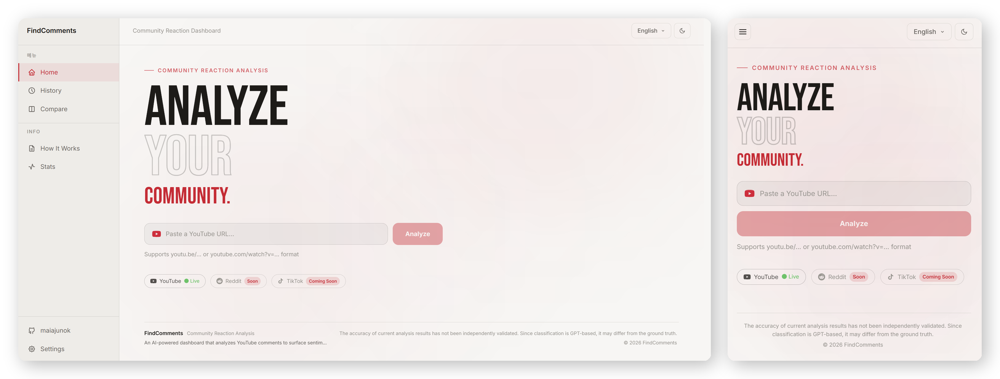

# YouTube Comment Insight Analyzer
**AI-powered YouTube comment sentiment analysis dashboard**

[](https://vuejs.org/)
[](https://fastapi.tiangolo.com/)
[](https://openai.com/)
[](/)

<a href="https://youtube-comment-insight-orcin.vercel.app" target="_blank" rel="noopener">
  
</a>

<p><sub>👆 Click the screenshot to open the <a href="https://youtube-comment-insight-orcin.vercel.app" target="_blank" rel="noopener"><b>live demo</b></a></sub></p>

> Built as part of the **Seocho e-Sports Developer Academy** (Seocho District Office × T1 Esports), a frontend/full-stack developer training program.

## Highlights
- Full-stack AI dashboard built with Vue 3, TypeScript, FastAPI, and GPT-4o-mini
- Analyzes YouTube comments by sentiment, topic, timeline, and key reactions
- Cached history, side-by-side video comparison, stats dashboard, and PDF export
- BYOK — visitors bring their own OpenAI/YouTube API keys, nothing is stored server-side

---

## Overview

Paste any YouTube URL and instantly get a structured breakdown of what the audience thinks — sentiment distribution, trending topics, reaction timeline, and key insights extracted from thousands of comments using GPT-4o-mini.

```
┌─────────────────────────────────────────────────────────────┐
│                                                             │
│   🔗 Paste YouTube URL   →   Comments collected via API    │
│   🧠 Sentiment Analysis  →   Positive / Neutral / Negative │
│   🏷️  Topic Clustering   →   Auto-grouped by subject       │
│   📈 Reaction Timeline   →   Sentiment trends over time    │
│   💡 Key Insights        →   Top comments by likes         │
│   📊 Video Compare       →   Side-by-side comparison       │
│                                                             │
└─────────────────────────────────────────────────────────────┘
```

---

## Features

### 1. Comment Sentiment Analysis
- Collects public comments via YouTube Data API v3
- Classifies each comment as **Positive / Neutral / Negative** using GPT-4o-mini
- Displays overall sentiment distribution as a percentage bar
- Language ratio detection (Korean / English / Other)

### 2. Topic Classification
- Automatically clusters comments into topics
- Shows mention count and sentiment breakdown per topic
- Click any topic to view the full list of comments (drawer)
- Supports Korean ↔ English label translation

### 3. Reaction Timeline
- Visualizes sentiment changes over time after video upload
- Time buckets: `0–1h`, `1–24h`, `1–7d`, `7–30d`, `30d+`
- Shows positive/neutral/negative stacked bars per period

### 4. Analytics Metrics
| Metric | Description |
|--------|-------------|
| Sentiment Score | `positive% − negative%` overall index |
| Weighted Sentiment | Likes-weighted sentiment score |
| Comment Rate | Comments ÷ Views × 100 |
| Like Rate | Likes ÷ Views × 100 |
| Controversy Score | `min(positive, negative) × 2` |

### 5. Key Insights
- Surfaces the most-liked positive and negative comments per topic
- Up to 4 insights (2 positive, 2 negative)

### 6. History & Compare
- All analyzed videos are cached and accessible from the History tab
- Compare up to **3 videos side-by-side**
- Export analysis as PDF

### 7. Stats Dashboard
- Total analyses, comments processed, tokens used
- Estimated OpenAI API cost per analysis
- Average / min / max analysis duration

---

## Tech Stack

| Layer | Technology |
|-------|-----------|
| Frontend | Vue 3, TypeScript, Vite, Tailwind CSS 4, Pinia |
| Backend | FastAPI, Python |
| AI | OpenAI GPT-4o-mini (sentiment + topic classification) |
| Data | YouTube Data API v3 |
| Export | jsPDF, html2canvas |

---

## API Key Policy (BYOK)

This app does not ship with a shared OpenAI/YouTube API key. Each visitor brings their own keys, entered on the **Settings** page:

- Keys are stored **only in the browser** (`localStorage`) and sent to the backend **only as request headers** (`X-OpenAI-Key`, `X-YouTube-Key`) for that one request. The server never persists or logs them.
- Analyzing a **new** video requires both keys. Browsing **existing** analysis results (History / Stats / Compare) requires no key at all, since those endpoints only read the server's cached JSON.
- For local development, you may optionally set `OPENAI_API_KEY` / `YOUTUBE_API_KEY` in `backend/.env` as a fallback — the header value always takes priority when present.

## Getting Started

### Prerequisites
- Node.js `>=20`
- Python `3.10+`
- OpenAI API Key ([get one](https://platform.openai.com/api-keys)) and YouTube Data API v3 Key ([enable it](https://console.cloud.google.com/apis/library/youtube.googleapis.com)) — only needed to analyze *new* videos; can also be entered later in the app's Settings page instead of `.env`

### 1. Clone the repository
```bash
git clone https://github.com/maiajunok/youtube-comment-insight.git
cd youtube-comment-insight
```

### 2. (Optional) Set up environment variables
Only needed if you don't want to enter keys in the Settings page every time during local development. Create `backend/.env`:
```
OPENAI_API_KEY=your_openai_api_key
YOUTUBE_API_KEY=your_youtube_api_key
```

### 3. Run the backend
```bash
cd backend
pip install -r requirements.txt
uvicorn main:app --reload
```

### 4. Run the frontend
```bash
cd frontend
npm install
npm run dev
```

### 5. Open the app
| Service | URL |
|---------|-----|
| Frontend | http://localhost:5173 |
| Backend API | http://localhost:8000 |
| API Docs | http://localhost:8000/docs |

---

## Deployment

Deployed as two separate services:

| Layer | Platform | Notes |
|-------|----------|-------|
| Frontend | [Vercel](https://vercel.com) | Root directory: `frontend`. Build command: `vite build` (skips the strict type-check step). Env var: `VITE_API_URL` = the backend's public URL + `/api` |
| Backend | [Render](https://render.com) | Root directory: `backend`. Uses `render.yaml` at the repo root. Env var: `ALLOWED_ORIGINS` = the frontend's deployed URL (comma-separated if multiple) |

`OPENAI_API_KEY` / `YOUTUBE_API_KEY` are intentionally **not** set on the deployed backend — visitors supply their own via the Settings page (see BYOK policy above). The `backend/cache/` directory ships with the repo so History/Stats/Compare work immediately on a fresh deploy with zero keys.

**Live demo:** https://youtube-comment-insight-orcin.vercel.app

---

## Project Structure

```
youtube-comment-insight/
├── render.yaml              # Render blueprint (backend deploy config)
├── backend/
│   ├── main.py              # FastAPI app, SSE streaming endpoint, BYOK header handling
│   ├── sentiment.py         # GPT-4o-mini sentiment analysis
│   ├── topic.py             # Topic classification + clustering
│   ├── youtube.py           # YouTube Data API integration
│   ├── requirements.txt
│   └── cache/               # Analysis result cache (JSON) — shipped with the repo as seed data
│       └── comments/        # Per-topic comment cache
│
└── frontend/
    └── src/
        ├── features/
        │   ├── insight/
        │   │   ├── api/         # insightApi.ts — backend calls
        │   │   ├── components/  # VideoInfoCard, ReactionTimeline, KeyInsights …
        │   │   ├── pages/       # HomeView, HistoryView, CompareView
        │   │   ├── stores/      # Pinia analysis store
        │   │   └── types/       # TypeScript interfaces
        │   └── settings/        # BYOK API key input, theme, language
        ├── pages/               # StatsView, HowToView
        ├── layouts/             # AppLayout
        ├── router/              # Vue Router
        ├── shared/api/          # axios client, base URL config
        └── locales/             # i18n (ko / en / zh / ja) + How It Works content
```

---

## API Overview

### `POST /api/insight`
Analyzes a YouTube video. Streams progress via **Server-Sent Events (SSE)**. Cache hits need no headers; analyzing a new video requires both.

Headers (BYOK, both optional — fall back to the server's own `.env` if set):
```
X-OpenAI-Key: sk-...
X-YouTube-Key: AIza...
```

```json
{ "url": "https://www.youtube.com/watch?v=VIDEO_ID" }
```

SSE events:
```
data: {"step": "댓글 수집 중", "progress": 1}
data: {"step": "감정 분석 중", "progress": 2}
data: {"step": "토픽 분류 중", "progress": 3}
data: {"step": "done", "data": { ... }}
data: {"step": "error", "code": "MISSING_YOUTUBE_KEY" | "MISSING_OPENAI_KEY"}
data: {"step": "error", "detail": "..."}
```

### `GET /api/history`
Returns list of all previously analyzed videos. No key required — reads only the server cache.

### `GET /api/history/{video_id}`
Returns cached analysis for a specific video. No key required.

### `GET /api/comments/{video_id}?topic=&sentiment=`
Returns filtered comments by topic and sentiment. No key required.

### `POST /api/refresh/{video_id}`
Clears cache and forces re-analysis.

### `GET /api/stats`
Returns token usage and cost statistics. No key required.

### `POST /api/translate-labels`
Translates topic labels to English. Accepts the same `X-OpenAI-Key` header; silently returns the original labels if no key is available.

---

## Coming Soon
- Reddit comment analysis
- TikTok comment analysis
- Voice-based search

---

---

# YouTube 댓글 인사이트 분석기

**AI 기반 YouTube 댓글 감정 분석 대시보드**

🌐 <b><a href="https://youtube-comment-insight-orcin.vercel.app" target="_blank" rel="noopener">바로 써보기 →</a></b>

> 서초구청과 T1이 함께하는 **서초 e스포츠 개발자 아카데미** 프론트엔드/풀스택 개발자 양성 과정의 일환으로 제작한 프로젝트입니다.

## 하이라이트
- Vue 3, TypeScript, FastAPI, GPT-4o-mini로 만든 풀스택 AI 대시보드
- 댓글을 감정 · 토픽 · 타임라인 · 핵심 반응 기준으로 분석
- 분석 기록 캐시, 영상 비교, 통계 대시보드, PDF 내보내기 지원
- BYOK 방식 — 방문자가 본인 API 키를 직접 입력, 서버엔 저장 안 함

---

## 소개

YouTube URL을 붙여넣으면 AI가 댓글을 수집하고 감정 분석 · 토픽 분류 · 반응 타임라인 · 핵심 인사이트를 시각화해 보여주는 대시보드입니다. GPT-4o-mini로 수천 개의 댓글을 분석합니다.

---

## 주요 기능

### 1. 댓글 감정 분석
- YouTube Data API v3로 공개 댓글 수집
- GPT-4o-mini로 **긍정 / 중립 / 부정** 분류
- 전체 감정 분포를 퍼센트 바로 시각화
- 언어 비율 감지 (한국어 / 영어 / 기타)

### 2. 토픽 분류
- 댓글을 주제별로 자동 그룹화
- 토픽별 언급 수 및 감정 비율 표시
- 토픽 클릭 시 해당 댓글 전체 보기 (드로어)
- 한국어 ↔ 영어 레이블 번역 지원

### 3. 반응 타임라인
- 영상 업로드 이후 시간대별 감정 변화 시각화
- 구간: `0–1h`, `1–24h`, `1–7d`, `7–30d`, `30d+`
- 구간별 긍정/중립/부정 스택 바 차트

### 4. 분석 지표
| 지표 | 설명 |
|------|------|
| 감정 점수 | `긍정% − 부정%` 전체 지수 |
| 가중 감정 점수 | 좋아요 수 가중 감정 점수 |
| 댓글 비율 | 댓글 수 ÷ 조회수 × 100 |
| 좋아요 비율 | 좋아요 수 ÷ 조회수 × 100 |
| 논란 지수 | `min(긍정, 부정) × 2` |

### 5. 핵심 인사이트
- 토픽별 좋아요 수 기준 상위 긍정 · 부정 댓글 추출
- 최대 4개 인사이트 (긍정 2개, 부정 2개)

### 6. 히스토리 & 비교
- 분석된 영상은 모두 캐시로 저장되어 히스토리 탭에서 확인 가능
- 최대 **3개 영상 나란히 비교**
- 분석 결과 PDF 내보내기

### 7. 통계 대시보드
- 전체 분석 수, 처리 댓글 수, 사용 토큰 수
- OpenAI API 예상 비용
- 분석 소요 시간 (평균 / 최소 / 최대)

---

## 기술 스택

| 구분 | 기술 |
|------|------|
| Frontend | Vue 3, TypeScript, Vite, Tailwind CSS 4, Pinia |
| Backend | FastAPI, Python |
| AI | OpenAI GPT-4o-mini (감정 분석 + 토픽 분류) |
| 데이터 수집 | YouTube Data API v3 |
| PDF 출력 | jsPDF, html2canvas |

---

## API 키 정책 (BYOK)

이 앱은 공용 OpenAI/YouTube API 키를 내장하지 않습니다. 방문자가 **설정** 페이지에서 본인의 키를 직접 입력합니다:

- 키는 **브라우저(localStorage)에만** 저장되며, 분석 요청 시 헤더(`X-OpenAI-Key`, `X-YouTube-Key`)로만 전송됩니다. 서버는 키를 저장하거나 로그로 남기지 않습니다.
- **새 영상**을 분석하려면 두 키가 모두 필요합니다. 이미 분석된 영상의 기록·통계·비교(History/Stats/Compare)는 서버 캐시만 읽으므로 키 없이 자유롭게 볼 수 있습니다.
- 로컬 개발 시에는 편의를 위해 `backend/.env`에 `OPENAI_API_KEY`/`YOUTUBE_API_KEY`를 fallback으로 설정할 수 있습니다 — 헤더 값이 있으면 항상 헤더가 우선합니다.

## 시작하기

### 사전 준비
- Node.js `>=20`
- Python `3.10+`
- OpenAI API 키([발급](https://platform.openai.com/api-keys)), YouTube Data API v3 키([발급](https://console.cloud.google.com/apis/library/youtube.googleapis.com)) — 새 영상 분석에만 필요하며, `.env` 대신 앱의 설정 페이지에서 나중에 입력해도 됩니다

### 1. 저장소 클론
```bash
git clone https://github.com/maiajunok/youtube-comment-insight.git
cd youtube-comment-insight
```

### 2. (선택) 환경 변수 설정
로컬 개발 중 매번 설정 페이지에 키를 입력하기 번거로울 때만 필요합니다. `backend/.env` 파일 생성:
```
OPENAI_API_KEY=your_openai_api_key
YOUTUBE_API_KEY=your_youtube_api_key
```

### 3. 백엔드 실행
```bash
cd backend
pip install -r requirements.txt
uvicorn main:app --reload
```

### 4. 프론트엔드 실행
```bash
cd frontend
npm install
npm run dev
```

### 5. 서비스 접속
| 서비스 | URL |
|--------|-----|
| 프론트엔드 | http://localhost:5173 |
| 백엔드 API | http://localhost:8000 |
| API 문서 (Swagger) | http://localhost:8000/docs |

---

## 배포

프론트엔드와 백엔드를 별도 서비스로 배포합니다:

| 계층 | 플랫폼 | 비고 |
|------|--------|------|
| 프론트엔드 | [Vercel](https://vercel.com) | Root Directory: `frontend`. 빌드 명령: `vite build` (엄격한 타입체크 단계 생략). 환경변수: `VITE_API_URL` = 백엔드 공개 URL + `/api` |
| 백엔드 | [Render](https://render.com) | Root Directory: `backend`. 저장소 루트의 `render.yaml` 사용. 환경변수: `ALLOWED_ORIGINS` = 배포된 프론트엔드 URL (여러 개면 콤마로 구분) |

배포된 백엔드에는 의도적으로 `OPENAI_API_KEY`/`YOUTUBE_API_KEY`를 설정하지 않습니다 — 방문자가 설정 페이지에서 본인 키를 입력합니다(위 BYOK 정책 참고). `backend/cache/` 디렉터리가 저장소에 함께 포함되어 있어 키 없이도 배포 직후 History/Stats/Compare가 바로 동작합니다.

**배포 주소:** https://youtube-comment-insight-orcin.vercel.app

---

## 출시 예정
- Reddit 댓글 분석
- TikTok 댓글 분석
- 음성 검색
